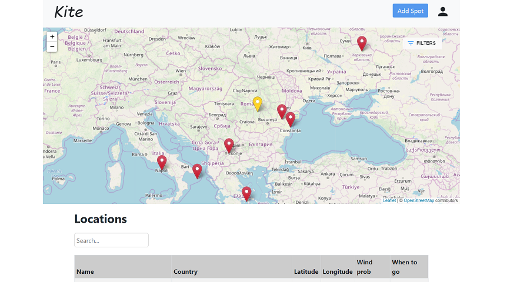
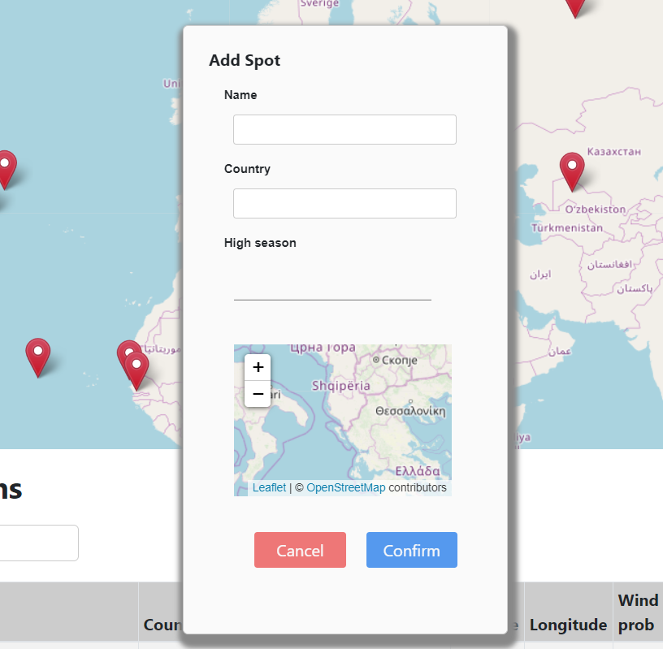
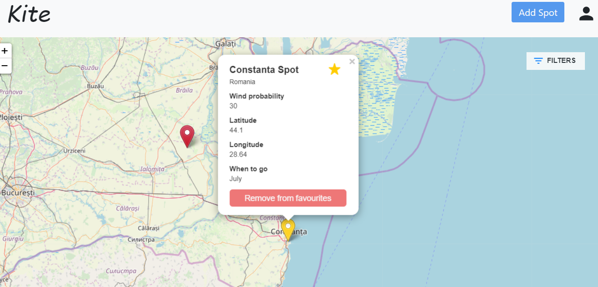

# Kitesurfing Locations Web App

An amazing and interactive web app that I created using React and LeafletJS, that displays kitesurfing locations around the world and allows you to browse, filter, favourite them, or even add new spots, everything being connected to an online API, so that data is persistent.
I did this project as part of a challenge and I had it originally uploaded on Gitlab.

# Main Page

# Adding a new spot

# Details pop-up

